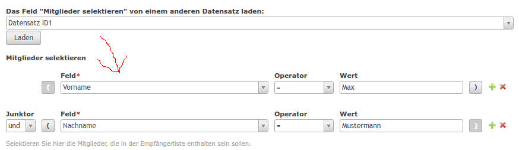

# Contao Field Value Copier Bundle

This simple module offers a backend dca input type for showing a giving the user the opportunity to copy a certain dca's field value from one record to another in Contao CMS. This is useful for fields that are very complex to configure.



## Features

### Technical instructions

Use the inputType "fieldValueCopier" for your field.

```
'someField' => array(
    // no label necessary
    'inputType' => 'fieldValueCopier',
    'eval'      => array(
        'fieldValueCopier' => array(
            'table' => 'tl_my_dca',
            'field' => 'myField',
            'options_callback' => array('Namespace\SomeClass', 'getOptions')
        )
    )
)
```