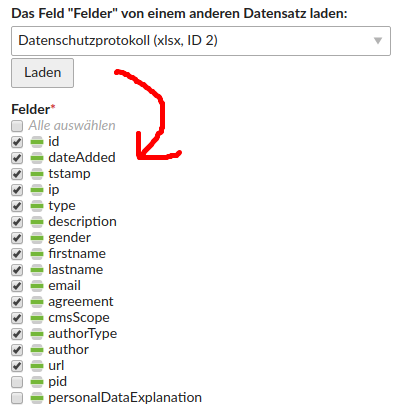

# Contao Field Value Copier Bundle

This simple module offers a backend dca input type for showing a giving the user the opportunity to copy a certain dca's field value from one record to another in Contao CMS. This is useful for fields that are very complex to configure.



## Features

### Technical instructions

Add the following to the relevant DCA:

```
'complexFieldCopier' => [
    // no label necessary
    'inputType' => 'fieldValueCopier',
    'eval'      => [
        'fieldValueCopier' => [
            'table'            => 'tl_my_dca',
            'field'            => 'complexField',
            'config' => [
                // here all available config parameters found in \HeimrichHannot\UtilsBundle\Choice\ModelInstanceChoice::collect() are possible
                'labelPattern' => '%title% (ID %id%)' // all of the dca's fields can be used here
            ],
            'options_callback' => ['huh.field_value_copier.util.field_value_copier_util', 'getOptions']
        ]
    ]
],
'complexField' => [
    // ...
]
```